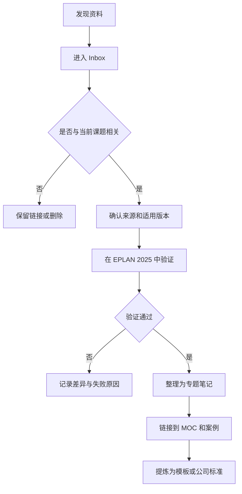

# EPLAN P8 2025 学习 Vault

> [!success] Vault 状态
> 本 Vault 已于 2026-07-19 正式启用。本文件是知识库根文件和 GitHub 项目说明；日常学习从 [[00_Home/EPLAN学习主页|EPLAN 学习主页]] 进入。

GitHub 浏览入口：[打开 EPLAN 学习主页](00_Home/EPLAN学习主页.md)

> [!abstract] 建设目标
> 建立一个由 Codex 持续维护、围绕真实非标自动化项目成长的 EPLAN Electric P8 2025 知识库。知识库不仅保存教程，还要逐步沉淀公司项目模板、符号与宏、部件数据、报表配置、设计规范和典型案例。

## 1. 核心原则

1. 以 EPLAN P8 2025 为操作基准。
2. 官方帮助用于确认事实和新版操作路径。
3. 2.7、2.8、2.9 教程主要学习工程思想，不直接照搬菜单位置。
4. 以实际项目推动学习，不以收集视频数量衡量进度。
5. 每个专题最终都要落到“输入—操作—输出—检查—复用”。
6. 外部资料先进入收件箱，经过验证后再进入正式知识区。
7. 保留资料来源、适用版本和验证状态，避免新旧版本混用。

## 2. 学习成果定义

完成第一阶段后，应能够独立完成一套小型非标自动化设备的电气工程，包括：

- 建立项目结构和页结构；
- 绘制主回路、24 VDC控制回路和安全相关回路；
- 完成PLC、远程I/O、伺服、传感器和执行器设计；
- 建立端子、插头及多芯电缆；
- 为设备分配真实部件；
- 创建并调用窗口宏、页宏和设备宏；
- 自动生成部件表、端子图表、电缆图表、PLC图表和连接列表；
- 输出PDF、线号、端子标识和制造资料；
- 执行项目检查并完成归档；
- 把可复用内容沉淀为公司模板和标准。

## 3. 资料来源与优先级

### 3.1 A级：官方资料

- [EPLAN Platform 2025 官方帮助](https://www.eplan.help/en-us/Infoportal/Content/Plattform/2025/Content/htm/EPLAN_Help_k_start.htm)
- EPLAN软件内帮助：在目标命令、属性或对话框中按 `F1`
- [易盼 eLearning 系列课程](https://www.eplan.com.cn/zh/services/eplan-elearning/)
- [易盼培训学院](https://www.eplan.com.cn/zh/services/training/)
- [Eplan Data Portal](https://www.eplan.com.cn/zh/products/eplan-data-portal)中的厂商部件数据
- EPLAN安装介质附带的示例项目、主数据与文档

用途：确认概念、属性、命令路径、版本差异和官方推荐工作流。

> [!warning] 官方旧版教程边界
> [EPLAN 初级人员教程入口](https://www.eplan.help/zh-CN/Infoportal/Content/htm/portal_tutorials.htm)中的 Electric P8 教程虽为官方经典资料，但入口明确标注只适用至 2.9.x。它用于理解完整流程，不作为 2025 菜单、Ribbon 或插入中心的操作依据。初学者资料分级见 [[10_官方资料/初学者精选学习资料|初学者精选学习资料]]。

### 3.2 B级：系统课程与优质视频

中文检索词：

- `EPLAN P8 2025 入门`
- `EPLAN 2024 完整项目`
- `EPLAN 2.9 项目实战`
- `EPLAN 端子排 电缆 报表`
- `EPLAN PLC 地址连接点`
- `EPLAN 宏 占位符 值集`
- `EPLAN 部件管理 SQL`
- `EPLAN 项目模板`

英文检索词：

- `EPLAN 2025 beginner tutorial`
- `EPLAN Electric P8 complete project`
- `EPLAN cable terminal reports`
- `EPLAN PLC navigator`
- `EPLAN macro project`
- `EPLAN parts management`

视频只记录链接、作者、适用版本、关键时间点和实践结论；不因“可能有用”而批量下载。

### 3.3 C级：实际工程资产

这是最有长期价值的资料：

- 完整示例项目；
- 项目模板和基本项目；
- 图框、表格和报表表单；
- 符号库；
- 窗口宏、符号宏、页宏和设备宏；
- 部件数据库及部件导出文件；
- 端子排、多芯电缆和PLC设计案例；
- 标签、线号、端子标识导出配置；
- PDF、Excel、DXF等导出配置；
- 项目检查方案；
- 项目归档、交付和版本管理规范。

> [!warning] 安全规则
> 来历不明的旧工程、部件库和宏不要直接覆盖当前主数据。先复制到隔离目录，保留原文件，再在测试环境中打开或导入。

## 4. 旧版教程兼容性

| 学习内容 | 2.7/2.9教程价值 | EPLAN 2025使用建议 |
|---|---:|---|
| 项目结构、页结构 | 高 | 学习概念，新版中重新确认命令位置 |
| 设备标识符DT | 高 | 原理基本延续 |
| 功能、连接、部件 | 高 | 重点掌握三者的数据关系 |
| 端子、插头、电缆 | 高 | 用2025界面重新完成案例 |
| PLC设计 | 高 | 核对新版导航器与数据交换方式 |
| 自动报表 | 高 | 表单与配置界面可能变化 |
| 宏、占位符、值集 | 高 | 注意新版插入中心和宏管理 |
| 菜单操作位置 | 中低 | 2022以后Ribbon界面变化明显 |
| 部件数据库配置 | 中 | 必须先确认数据库类型与兼容性 |
| 安装、授权 | 低 | 只采用当前版本官方资料 |
| API、脚本、插件 | 低 | 必须按2025 API和运行环境验证 |

判断规则：**旧教程学习工程方法，2025官方帮助确认实际操作。**

## 5. 建议的 Vault 目录

```text
EPLAN_P8_2025_Vault/
├─ 00_Home/
│  ├─ EPLAN学习主页.md
│  ├─ 初学者快速入口.md
│  ├─ 学习路线图.md
│  └─ 学习进度看板.md
├─ 01_Inbox/
│  ├─ 待整理资料/
│  └─ 临时笔记/
├─ 10_官方资料/
│  ├─ 官方帮助索引.md
│  ├─ 初学者精选学习资料.md
│  ├─ EPLAN_2025新功能.md
│  └─ 版本差异/
├─ 20_基础知识/
│  ├─ 项目与页/
│  ├─ 符号与功能/
│  ├─ 设备标识/
│  ├─ 连接与电位/
│  └─ 导航器/
├─ 30_工程对象/
│  ├─ 端子/
│  ├─ 插头/
│  ├─ 电缆/
│  ├─ PLC与IO/
│  ├─ 电源与配电/
│  ├─ 变频器与伺服/
│  └─ 安全回路/
├─ 40_部件与宏/
│  ├─ 部件管理/
│  ├─ Data_Portal/
│  ├─ 符号宏/
│  ├─ 窗口宏/
│  ├─ 页宏/
│  └─ 占位符与值集/
├─ 50_报表与制造/
│  ├─ 部件表/
│  ├─ 端子图表/
│  ├─ 电缆图表/
│  ├─ PLC图表/
│  ├─ 连接列表/
│  └─ 线号端子与铭牌/
├─ 60_案例工程/
│  ├─ 案例01_电机启停/
│  ├─ 案例02_PLC控制柜/
│  └─ 案例03_单轴自动化设备/
├─ 70_公司设计标准/
│  ├─ 项目模板/
│  ├─ 图框与表单/
│  ├─ 编号与命名规则/
│  ├─ 部件选型规则/
│  ├─ 出图检查表/
│  └─ 归档与交付规范/
├─ 80_问题与经验/
│  ├─ 故障排查/
│  ├─ 常见错误/
│  └─ 最佳实践/
├─ 90_附件/
│  ├─ 图片/
│  ├─ PDF/
│  ├─ 视频索引/
│  ├─ 外部文件索引/
│  ├─ 本机资料库_MOC.md
│  └─ 本机资料/（本机原始大文件，Git 忽略）
├─ 98_有意义书籍/（本机书籍原件，Git 忽略）
└─ 99_Templates/
   ├─ Template_专题笔记.md
   ├─ Template_视频课程.md
   ├─ Template_问题记录.md
   ├─ Template_工程案例.md
   └─ Template_部件宏资产.md
```

## 6. 知识库入口与MOC

建议建立以下地图式内容导航（MOC）：

- `EPLAN学习主页`：全库唯一总入口；
- `EPLAN基础设计_MOC`：项目、页、功能、连接、设备标识；
- `端子插头电缆_MOC`：制造接线相关知识；
- `PLC与IO_MOC`：PLC盒、连接点、地址及数据交换；
- `部件与宏_MOC`：部件、宏、占位符和值集；
- `报表与制造_MOC`：自动报表、标签和导出；
- `公司标准化_MOC`：模板、命名、检查和交付；
- `案例工程_MOC`：把知识链接到真实项目。

MOC只提供导航和学习顺序，不重复专题笔记正文。

## 7. 学习路线

### 阶段一：基础建模

- [ ] 认识EPLAN的数据化设计思想
- [ ] 创建项目并理解项目类型
- [ ] 建立结构标识和页结构
- [ ] 插入符号并理解功能定义
- [ ] 设置设备标识符
- [ ] 理解自动连接、连接定义点和电位
- [ ] 熟悉页、设备、连接和部件导航器

验收：完成一个接触器控制电机启停的小项目。

### 阶段二：典型自动化对象

- [ ] 断路器、接触器、继电器和电源
- [ ] PLC盒、PLC连接点和地址
- [ ] 传感器、阀、指示灯和按钮
- [ ] 伺服驱动器和电机
- [ ] 端子排及端子附件
- [ ] 插头和插针
- [ ] 多芯电缆、屏蔽和备用芯
- [ ] 急停、STO和安全相关信号的文档表达

验收：完成一套小型PLC控制柜的主要原理图。

### 阶段三：部件、宏与复用

- [ ] 部件数据结构和部件分配
- [ ] 从Data Portal取得并检查部件
- [ ] 自建部件及技术数据
- [ ] 创建窗口宏、符号宏和页宏
- [ ] 创建宏项目
- [ ] 使用占位符对象和值集
- [ ] 建立典型回路库

验收：同一套电机/伺服控制单元能通过宏快速复用并切换型号。

### 阶段四：报表与制造输出

- [ ] 封面、目录和页总览
- [ ] 部件表和设备清单
- [ ] 端子图表
- [ ] 电缆图表
- [ ] PLC图表
- [ ] 连接列表
- [ ] 线号、端子号和铭牌数据
- [ ] PDF及其他格式导出

验收：从原理图自动生成一套可用于采购、装配和接线的资料。

### 阶段五：公司标准化

- [ ] 公司项目结构
- [ ] 图框、封面和表单
- [ ] 设备编号和页编号规则
- [ ] 部件与宏命名规则
- [ ] 推荐器件库
- [ ] 项目检查方案
- [ ] 设计评审清单
- [ ] 归档、版本和交付规范

验收：新项目可以从公司基本项目或项目模板启动。

## 8. 首个综合案例

### 案例名称

`单轴伺服自动化设备电气工程`

### 建议范围

- 三相或单相总电源；
- 总断路器、24 VDC电源及支路保护；
- PLC或工业控制器；
- 伺服驱动器和伺服电机；
- 急停、STO、正负限位和原点传感器；
- 启动、停止、复位和状态指示；
- 柜内端子排；
- 电机、编码器、传感器和操作盒电缆；
- 一个多芯电缆案例；
- 部件表、端子图表、电缆图表和连接列表。

### 完成顺序

1. 定义设备边界和I/O清单；
2. 建立项目结构、页结构和设备标识规则；
3. 完成主回路和24 VDC配电；
4. 完成控制、安全和伺服信号；
5. 建立PLC I/O和地址；
6. 建立端子、插头和多芯电缆；
7. 分配真实部件；
8. 建立可复用设备宏；
9. 自动生成报表；
10. 执行检查、修正并归档；
11. 从案例中提取公司模板和标准回路。

## 9. 资料收集工作流



### 资料元数据

每份资料至少记录：

- 标题；
- 来源与作者；
- 原始链接或文件位置；
- 资料类型；
- 适用版本；
- 收集日期；
- 验证状态；
- 对应知识主题；
- 对应实际项目；
- 版权或使用限制。

## 10. 笔记模板

### 10.1 专题笔记模板

```markdown
---
title:
tags: [EPLAN]
eplan_version: 2025
source:
source_version:
verification: 待验证
created:
updated:
---

# 主题名称

## 解决什么问题

## 关键概念

## 前置条件

## EPLAN 2025 操作路径

## 操作步骤

## 关键属性与配置

## 输出结果

## 检查方法

## 常见错误

## 与旧版差异

## 实际项目应用

## 相关笔记

## 来源
```

### 10.2 视频课程模板

```markdown
---
title:
type: video-course
author:
url:
course_version:
verification: 待验证
---

# 视频名称

## 学习目的

## 关键时间点

| 时间 | 内容 | 是否已实践 |
|---|---|---|
| 00:00 |  | 否 |

## 有价值的操作

## 在 EPLAN 2025 中的差异

## 实践结果

## 后续任务
```

### 10.3 问题记录模板

```markdown
---
title:
type: troubleshooting
eplan_version: 2025
status: open
---

# 问题名称

## 现象

## 环境与前置条件

## 预期结果

## 排查过程

## 根因

## 解决方法

## 验证结果

## 如何预防
```

## 11. Codex 的维护边界

Codex可以负责：

- 建立和调整Vault目录；
- 把零散材料整理为Markdown；
- 生成MOC和双向链接；
- 识别重复笔记和失效链接；
- 对比2.7、2.9与2025的操作差异；
- 从项目记录中提炼检查表、SOP和公司标准；
- 维护任务状态、学习进度和变更日志；
- 在修改前检查现有文件，避免覆盖人工内容。

Codex不应擅自：

- 删除无法判断价值的资料；
- 覆盖EPLAN工程、宏或部件库；
- 把未经验证的网络教程写成确定事实；
- 把安全回路示意当作已验证的安全设计；
- 大规模改名或移动附件而不检查引用；
- 自动提交包含许可证、账号或公司机密的文件。

## 12. Codex CLI 首轮建库提示词

将下面提示词复制到 Codex CLI，并把路径替换为实际Vault路径。

```text
你正在维护一个用于学习 EPLAN Electric P8 2025 并沉淀公司电气设计标准的 Obsidian Vault。

Vault路径：<填写实际绝对路径>

本轮目标：
1. 先只读检查Vault现状、Git状态以及已有AGENTS.md、CLAUDE.md、README、目录规范和模板，不覆盖现有内容。
2. 阅读根目录《README.md》，以其中的目录、学习路线和维护边界作为建库基线。
3. 若目录与现有Vault规范冲突，优先兼容现有规范，并在执行前列出映射方案。
4. 创建缺失的EPLAN学习目录，但不要创建大量空白专题文件。
5. 创建以下核心文件：
   - EPLAN学习主页.md
   - 学习路线图.md
   - 学习进度看板.md
   - 官方帮助索引.md
   - 案例工程_MOC.md
   - 公司标准化_MOC.md
6. 在99_Templates中建立专题笔记、视频课程、问题记录、工程案例和部件宏资产模板。
7. 所有Markdown使用UTF-8、相对Wiki链接和一致的YAML属性；不要虚构尚未验证的知识内容。
8. 建立CHANGELOG.md，记录本轮新增、修改、待确认事项。
9. 完成后检查断链、重复文件名和目录结构，并展示变更摘要。
10. 如果当前目录已由Git管理，只提交与本任务直接相关的文件；提交前先展示git diff并等待我确认。若未使用Git，不要自行初始化，先说明建议。

执行方式：先检查并给出简短计划，然后直接完成安全且可逆的建库工作；遇到会覆盖、删除、批量移动或改变现有规范的操作时暂停并询问。
```

## 13. Codex 日常资料整理提示词

```text
请维护当前EPLAN P8 2025 Obsidian Vault。

输入资料：<粘贴文字、链接或指定文件>
本次主题：<填写主题>
来源版本：<2025/2024/2.9/2.7/未知>

要求：
1. 先检索Vault内相关笔记，判断应更新现有笔记还是新建笔记，避免重复。
2. 区分官方事实、外部教程观点、你的推断和本人实机验证结果。
3. 对旧版资料，保留其工程思想，并单列“与EPLAN 2025的差异”和“待验证事项”。
4. 按专题笔记模板整理，补充YAML、来源、相关链接、MOC入口和实际项目应用。
5. 不确定的信息标记为“待验证”，不要写成确定结论。
6. 如果输入涉及端子、电缆、PLC、部件、宏或报表，链接到对应MOC和综合案例。
7. 更新学习进度看板和CHANGELOG，但不要改变已经人工确认的完成状态。
8. 修改后检查Wiki链接、重复标题和Markdown格式，最后给出变更摘要与下一项最小实践任务。
```

## 14. Codex 学完一课后的提示词

```text
我刚完成一项EPLAN学习，以下是原始记录：

<粘贴课程笔记、截图识别文字、操作过程或问题>

请执行：
1. 判断它属于哪个知识主题和学习阶段。
2. 将内容整理成可复用的EPLAN P8 2025专题笔记。
3. 把“照着做的步骤”转化为“目的—前置条件—步骤—关键属性—输出—检查”的结构。
4. 标出课程版本与EPLAN 2025可能存在的差异。
5. 提炼常见错误、检查点和实际项目应用。
6. 关联已有MOC、案例工程和公司标准候选项。
7. 给我一个不超过30分钟的实机练习，用于验证本课内容。
8. 未经验证的内容标记为待验证，不要自动升级为公司标准。
```

## 15. Codex 周度复盘提示词

```text
请对当前EPLAN学习Vault执行周度复盘，只分析和整理与EPLAN相关的内容。

1. 汇总本周新增、更新、已验证和待验证笔记。
2. 检查Inbox中尚未处理的资料，按价值和当前学习阶段排序。
3. 检查重复主题、孤立笔记、失效Wiki链接、缺少来源和缺少版本标记的问题。
4. 根据学习路线评估进度，不因只有笔记而判定技能已经掌握；必须有实机操作或案例成果。
5. 列出下周最重要的三个学习任务，每项必须对应一个可验收输出。
6. 识别可以提炼为公司模板、标准回路、检查表或SOP的候选内容，但不要未经确认直接升级。
7. 更新学习进度看板和CHANGELOG。
8. 最后输出：本周成果、主要缺口、下周计划、需要我确认的事项。
```

## 16. Codex 工程资料提炼提示词

```text
请分析指定的EPLAN工程资料或导出文档：<填写文件或目录>

目标不是简单摘要，而是提取可复用的公司工程资产。

请完成：
1. 识别项目结构、页结构、设备标识、编号规则和主要系统边界。
2. 汇总电源、PLC、I/O、伺服、传感器、端子、插头和电缆的组织方式。
3. 识别可复用回路、宏、表单、部件和检查规则。
4. 区分通用设计、项目特例和可能存在的问题。
5. 不修改原工程文件；所有结论先写入案例分析笔记。
6. 对涉及电气安全的内容明确标记依据、假设和待专业复核项。
7. 生成“可复用资产候选清单”和“进入公司标准前的验证清单”。
8. 将结果链接到案例工程MOC和公司标准化MOC，并更新CHANGELOG。
```

## 17. 建议的 AGENTS.md 内容

将以下内容放在Vault根目录的 `AGENTS.md`，供Codex每次进入仓库时读取。若Vault已有全局规则，应合并而不是覆盖。

```markdown
# EPLAN Learning Vault Instructions

## Purpose
本Vault用于学习EPLAN Electric P8 2025，并逐步沉淀非标自动化电气设计知识、案例与公司标准。

## Source of truth
- EPLAN 2025官方帮助优先于旧版教程。
- 旧版教程可以用于理解概念，但版本差异必须明确记录。
- 未经实机验证的内容标记为“待验证”。
- 外部教程、推断和公司确认标准必须明确区分。

## Editing rules
- 修改前先搜索相关笔记，优先更新而非重复创建。
- 保留人工内容、来源、版本信息和验证状态。
- 使用UTF-8 Markdown、YAML属性和相对Wiki链接。
- 新笔记应至少链接到一个MOC或案例。
- 不创建无内容的占位笔记。
- 不擅自删除、覆盖、批量移动或批量改名。
- 移动文件前检查并修复引用。
- 不修改EPLAN工程、数据库、宏或主数据，除非任务明确授权且已有备份。
- 不把未验证内容直接升级为公司标准。

## Safety
- 电气安全相关内容必须写明适用边界、依据和待复核事项。
- 不保存许可证密钥、账号、密码或客户机密。
- 遇到破坏性操作、规范冲突或目标不明确时暂停并询问。

## Completion checks
- 检查Markdown格式和YAML。
- 检查重复标题、孤立笔记和失效Wiki链接。
- 更新相关MOC、进度看板和CHANGELOG。
- 汇报修改文件、关键结论、待验证项和下一步建议。
```

## 18. 推荐的 Git 管理方式

Vault如果用于长期维护，建议使用Git，但需排除不适合版本控制的缓存和大文件。

建议纳入版本控制：

- Markdown笔记；
- 模板；
- 小型配置文件；
- 索引与变更日志；
- 明确允许保存的脚本。

建议谨慎处理或忽略：

- Obsidian缓存和工作区状态；
- 大型视频、安装包和临时导出文件；
- EPLAN自动备份和临时文件；
- 含客户机密的完整工程；
- 许可证、账号和本机环境文件。

推荐提交节奏：

1. 建库与目录调整；
2. 每个完整专题；
3. 每个案例里程碑；
4. 公司标准经人工确认后；
5. 大规模重构前后分别建立清晰提交点。

## 19. 第一周行动计划

### 第1天：环境和资料盘点

- [ ] 确认EPLAN确切版本、更新号、语言和许可证功能范围
- [ ] 收集官方帮助、示例项目和eLearning入口
- [ ] 创建Vault核心目录、主页、MOC和模板

输出：可导航的Vault骨架。

### 第2天：项目与页面

- [ ] 创建练习项目
- [ ] 设置结构标识和页结构
- [ ] 理解项目、页、功能和设备的关系

输出：练习项目的结构页、封面和原理图页。

### 第3天：电机启停案例

- [ ] 插入断路器、接触器、热继电器、电机和按钮
- [ ] 设置设备标识、连接和交叉引用
- [ ] 检查错误信息

输出：可检查的电机启停原理图。

### 第4天：PLC与I/O

- [ ] 建立PLC盒和连接点
- [ ] 分配输入输出地址
- [ ] 建立传感器和执行器连接

输出：PLC I/O原理图和地址清单。

### 第5天：端子与电缆

- [ ] 创建端子排
- [ ] 建立插头与多芯电缆
- [ ] 处理屏蔽、备用芯和PE

输出：端子和电缆数据完整的工程。

### 第6天：部件和报表

- [ ] 分配真实部件
- [ ] 生成部件表、端子图表、电缆图表和连接列表

输出：第一套自动生成制造资料。

### 第7天：复盘和标准化

- [ ] 修正项目检查结果
- [ ] 整理本周笔记和问题
- [ ] 提炼一个标准回路和一份检查表候选

输出：案例V1、周度复盘和下一周计划。

## 20. Vault 正式启用后的下一步

1. 从 [[00_Home/EPLAN学习主页|EPLAN 学习主页]] 进入知识库。
2. 在 EPLAN 2025 虚拟机中完成环境盘点与首个练习项目。
3. 从“单轴伺服自动化设备电气工程”开始实践。
4. 每次课程结束，使用“学完一课后的提示词”整理资料。
5. 每周使用“周度复盘提示词”维护进度和知识质量。
6. 通过 Git 保存 Markdown、索引和小型配置；大型资料、EPLAN 工程与虚拟机文件不进入普通 Git 历史。

> [!success] 最终目标
> 将学习资料逐步转化为公司可复用的电气工程生产资料，使EPLAN从绘图工具升级为标准化、模块化和自动化设计平台，并为后续与SolidWorks、PLC、ERP及AI工程智能体协同打下数据基础。
